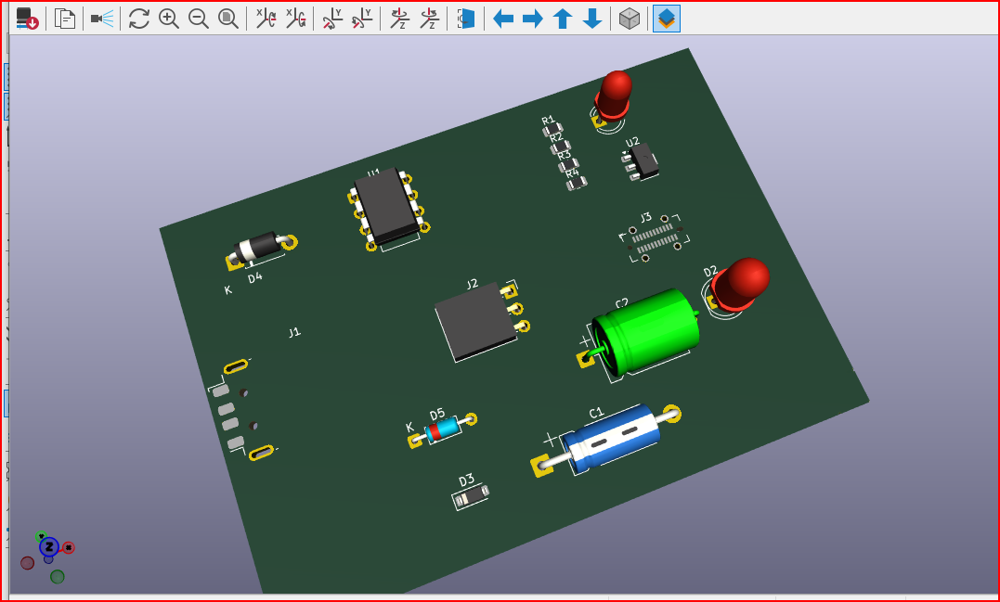

# ATtiny85 USB Development Board

Custom-designed USB-powered ATtiny85 development board created using KiCad.

This project demonstrates PCB design, schematic creation, USB interfacing, voltage regulation, and embedded hardware development.

---

# Project Overview

The board is based on the ATtiny85 microcontroller and includes:

- USB power input
- 5V voltage regulation
- USB data line protection
- LED status indication
- Compact PCB layout

This project was designed for learning embedded systems and PCB development.

---

# Features

✅ USB Powered  
✅ ATtiny85 Microcontroller  
✅ 5V Voltage Regulation  
✅ USB Protection Circuit  
✅ LED Indicator  
✅ Compact PCB Design  
✅ Designed in KiCad  

---

# Hardware Components

| Component | Description |
|---|---|
| ATtiny85-20P | AVR Microcontroller |
| MC78L05 | 5V Voltage Regulator |
| Micro USB Connector | USB Power/Input |
| Zener Diodes | USB Data Protection |
| Capacitors | Voltage Filtering |
| Resistors | Current Limiting |
| LED | Power Indicator |

---

# Software Used

- KiCad
- Embedded C
- AVR Toolchain

---

# Schematic


---

# PCB Layout



---

# Project Structure

```bash
ATtiny85-USB-PCB/
│
├── README.md
│
├── Images/
│   ├── schematic_usb.png
│   ├── power_block.png
│   ├── full_schematic.png
│   ├── pcb_layout.png
│   └── pcb_editor.png
│
├── PCB/
│   ├── pcb1.kicad_pcb
│   ├── pcb1.kicad_pro
│   ├── pcb1.kicad_prl
│   └── pcb1.kicad_sch
│
└── Gerber/
```

---

# Design Blocks

## USB Block
- USB power input
- USB data communication lines
- Zener diode protection

## Power Block
- 5V voltage regulation using MC78L05
- Power filtering capacitors
- LED power indication

## Microcontroller Block
- ATtiny85 microcontroller
- GPIO connections
- Embedded control section

---

# Learning Outcomes

Through this project I learned:

- PCB Design using KiCad
- Schematic Design
- USB Hardware Basics
- Voltage Regulation
- Embedded System Design
- PCB Component Placement
- Routing Concepts

---

# Future Improvements

- Add USB bootloader
- Improve PCB routing
- Add ISP programming header
- Convert design to SMD version
- Add USB-UART communication

---

# Author

**Sumit Kumar**  
Electrical and Electronics Engineering Student

---

# License

This project is open-source and available under the MIT License.
